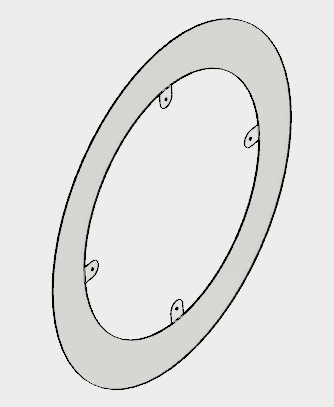
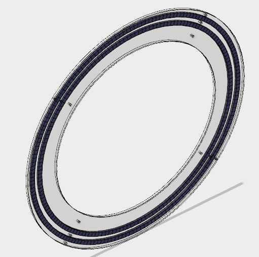

# Superconductor-Track
The track is designed to allow a superconducting puck to float around the track path but not to deviate. The track is comprised of a metal base (steel) that has been cut by a water jet.  It was painted to avoid rust.  The base has for leg holes along the inter diameter, 9-12'' thorlabs optical posts with plastic feet were used.  This allows it to be flipped during a demonstrations.  

The rings are laser cut along with the top.  The rings are screwed to the base and the magnets are placed in the grooves.  The screws are then removed and the top is placed on and screwed down. This prevents any metal objects from sticking to the magnets or the megnets getting out of the grooves.  The magnets are 1/2x1/2x1/4'' N52, the are arrange with the inner ring having all north facing up and the outer ring having all south pointing up.  The track will have a homogeneous magnetic field around the magnets path, but a hetergeneous field when moving any other way (creates flux pinning to prevent unwanted motion).

